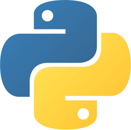
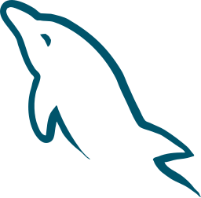
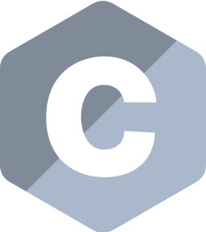
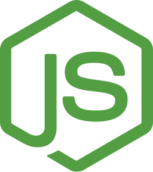

<!-- "Hi" GIF -->

  
   

<!-- Introduction -->

## Welcome to my GitHub! 👋 So glad you’re here!

I’m Sriranjan Srikanth, a passionate Software Engineer and recent Master’s graduate in Computer Science from Arizona State University. I specialize in building full-stack web applications and scalable, real-world software systems. I'm currently open to full-time Software Engineer roles in the United States.

<!-- Technical Skills -->

## 🛠️ Technical Skills:

- **Programming Languages:** JavaScript, TypeScript, Java, Python, SQL, C, C++, HTML, CSS
- **Frontend:** React.js, Next.js, Redux, Tailwind CSS, NextAuth.js
- **Backend:** Spring Boot, Spring Data JPA, Node.js, Express.js, OAuth, Axios
- **Databases:** MySQL, PostgreSQL, MongoDB, Firebase, Neo4j
- **DevOps & Cloud:** AWS (EC2, S3, Lambda, CloudWatch), Docker, Kubernetes, Git, Apache Kafka
   
   

<!-- Logos -->

&nbsp;

&nbsp;

&nbsp;

&nbsp;

&nbsp;

&nbsp;

&nbsp;

&nbsp;

&nbsp;

&nbsp;

&nbsp;

&nbsp;

&nbsp;

&nbsp;

&nbsp;

&nbsp;

&nbsp;

&nbsp;

&nbsp;

&nbsp;

&nbsp;

&nbsp;

&nbsp;

&nbsp;
<!-- 
&nbsp; -->

&nbsp;

&nbsp;

<!-- Contact Information -->
<h2 align="center">Get in touch 
</h2>

  <i>Got something in mind? Hit me up!</i>
  

    &nbsp;
    
    
  

