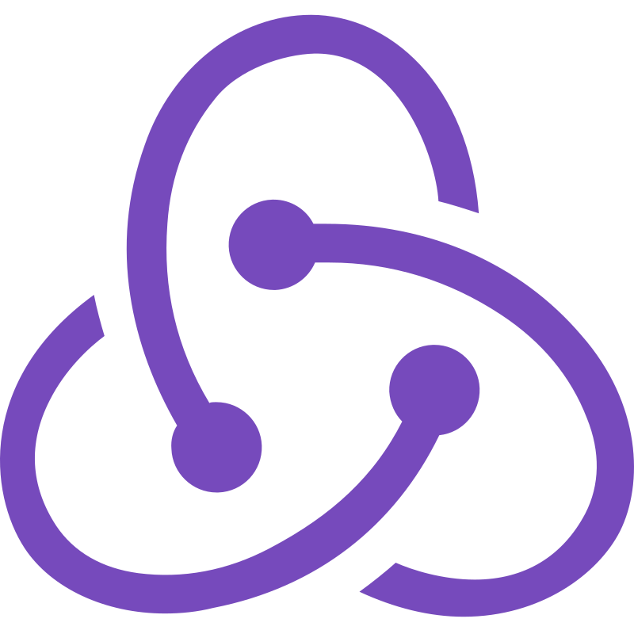
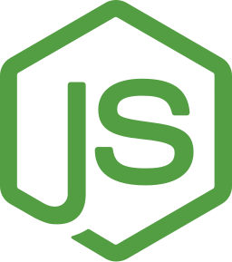
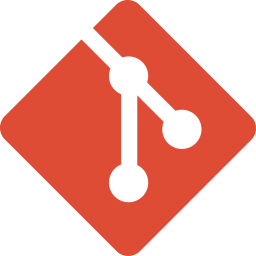

<!-- "Hi" GIF -->

  
   

<!-- Introduction -->

## Welcome to my GitHub! So glad you're here!

I'm Sriranjan Srikanth, a Software Engineer with 2+ years of experience building end-to-end production systems across backend pipelines, cloud infrastructure, AI integration, and full-stack applications. As a founding engineer, I shipped an enterprise MVP from 0 to 1 owning the full product lifecycle from architecture and development to deployment and customer onboarding, launching in under 5 months with 3 enterprise beta customers. My work spans AI agents and ETL pipelines, AWS cloud infrastructure, and full-stack applications with TypeScript, React, Next.js, Spring Boot, and PostgreSQL.

<!-- Technical Skills -->

## Technical Skills:

- **Programming Languages:** TypeScript, JavaScript, Java, Python, C, C++, HTML, CSS
- **Frontend:** Next.js, React, Redux, Tailwind CSS, NextAuth.js
- **Backend & APIs:** Node.js, Express.js, BullMQ, REST APIs, GraphQL, WebSockets, OAuth 2.0, JWT, Spring Boot, Spring Data JPA
- **Cloud & Infrastructure:** AWS CDK, CloudFormation, ASG, ALB, AppStream 2.0, SES, OpenSearch, EC2, ECR, S3, Lambda, Bedrock
- **Databases:** PostgreSQL, RDS, Supabase, Redis, ElastiCache, MongoDB, Neo4j, MySQL, Firebase
- **DevOps & Tools:** Docker, Kubernetes, Apache Kafka, Kafka Connect, Git
- **Testing:** Jest, React Testing Library, JUnit, Mockito
   
   

<!-- Logos -->

&nbsp;

&nbsp;

&nbsp;

&nbsp;

&nbsp;

&nbsp;

&nbsp;

&nbsp;

&nbsp;

&nbsp;

&nbsp;

&nbsp;

&nbsp;

&nbsp;

&nbsp;

&nbsp;

&nbsp;

&nbsp;

&nbsp;

&nbsp;

&nbsp;

&nbsp;

&nbsp;

&nbsp;

&nbsp;

&nbsp;

&nbsp;

&nbsp;

&nbsp;

&nbsp;

<!-- Contact Information -->
<h2 align="center">Get in touch 
</h2>

  <i>Got something in mind? Hit me up!</i>
  

     
    
    
  

